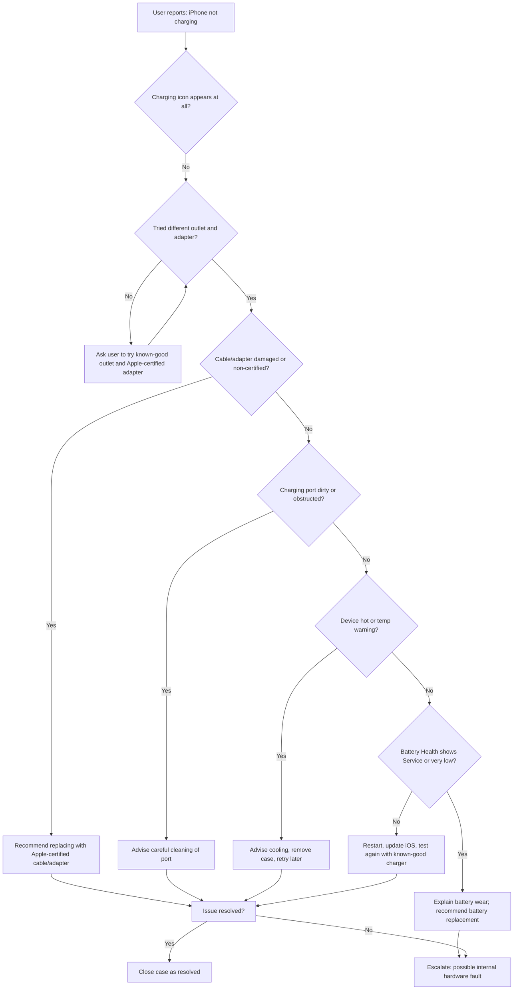
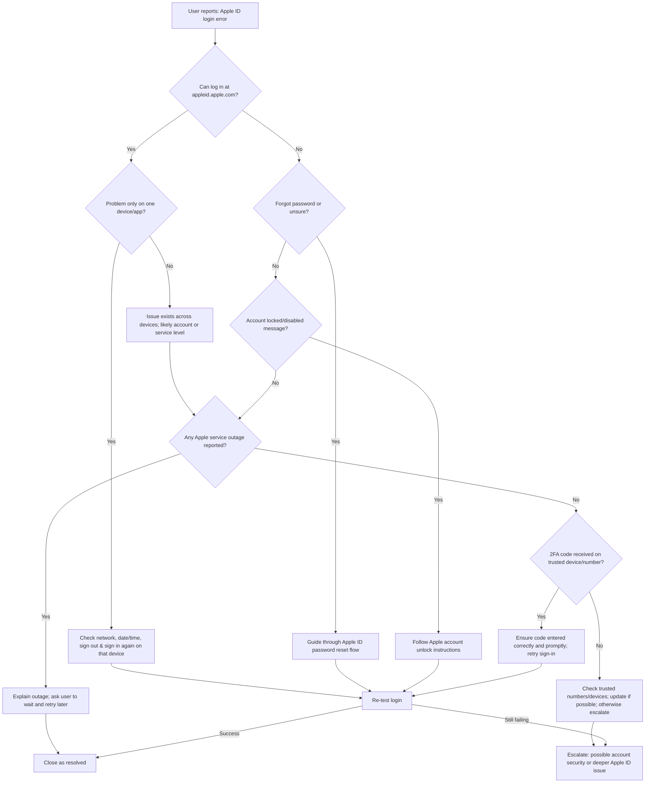

## Consumer Device Diagnostic & Support System

Apple Device Troubleshooting Simulation Project

---

### 1. iPhone Not Charging

#### Problem

- iPhone does not charge, charges intermittently, or charges very slowly when connected to power.

#### Diagnostic Steps

1. **Verify power source**
   - Try a different wall outlet or power strip.
   - Try a different USB port if using a computer.
2. **Check cable and adapter**
   - Inspect cable for fraying, bends, discoloration, or exposed wires.
   - Try an Apple-certified cable and adapter (known-good).
3. **Inspect charging port**
   - Look for dust, lint, or debris in the Lightning/USB‑C port.
   - Gently clean with a non-metal tool (e.g., wooden or plastic toothpick).
4. **Check case and accessories**
   - Remove the phone case (especially rugged or magnetic cases).
   - If using MagSafe or wireless charging, test by:
     - Removing the case.
     - Aligning carefully on the charger.
     - Trying a different wireless charger.
5. **Software-side checks**
   - Check for “Charging on Hold” or temperature warnings on screen.
   - Restart the device.
   - Check for and install iOS updates.
6. **Battery & charging settings**
   - Go to `Settings > Battery > Battery Health & Charging`.
   - Check if “Optimized Battery Charging” is delaying charging.
7. **Hardware validation**
   - Test with a known-good charger on a known-good outlet.
   - Observe:
     - Does any charging icon appear?
     - Does the device heat abnormally?

#### Likely Root Causes

- Faulty or non-certified cable or power adapter.
- Dirty, obstructed, or physically damaged charging port.
- Overheating or temperature control limiting charging.
- Battery degradation (battery health low or “Service” status).
- Internal hardware issues (power IC, charging circuitry, or liquid damage).

#### Resolution

- Replace the cable and/or adapter with Apple-certified versions.
- Carefully clean the charging port and remove visible obstructions.
- Remove cases or accessories that may interfere with charging.
- Allow the device to cool down; charge in a cool, well-ventilated area.
- Restart the device and update iOS to the latest version.
- If battery health is poor:
  - Educate user about battery wear.
  - Recommend battery replacement or service.

#### Escalation Criteria

Escalate to higher-level support or repair when:

- The device does not respond to any charger or outlet combinations.
- There is visible liquid damage, corrosion, or physical damage to the port.
- The device overheats while charging or shuts down unexpectedly.
- Battery health is extremely low and user reports severe charging/battery issues.
- Multiple known-good accessories have been tested with no improvement.

#### Decision Tree (Flowchart)



---

### 2. MacBook Slow Performance

#### Problem

- MacBook feels slow:
  - Apps open slowly.
  - Frequent spinning beachball.
  - System lag, stuttering, or high fan noise.

#### Diagnostic Steps

1. **Clarify symptoms and context**
   - When is it slow? Boot, specific apps, or all the time?
   - Any recent changes (new apps, updates, storage nearly full)?
2. **Check resource usage (Activity Monitor)**
   - Open **Activity Monitor** → **CPU** tab:
     - Look for processes consistently using very high CPU.
   - **Memory** tab:
     - Check memory pressure (green/yellow/red).
   - **Disk** tab:
     - Check for processes causing heavy disk activity.
3. **Check storage space**
   - Apple menu → `About This Mac` → `Storage`.
   - Verify if free space is at least 10–15% of total disk capacity.
4. **Review startup items**
   - `System Settings > General > Login Items` (or `Users & Groups > Login Items` on older macOS).
   - Note and disable unnecessary apps that start automatically.
5. **Software updates**
   - Check for macOS updates.
   - Check for app updates (App Store or vendor site).
6. **Background processes**
   - Look for:
     - Cloud sync (iCloud, Dropbox, Google Drive).
     - Spotlight indexing (first hours after OS or major update).
     - Time Machine backups.
7. **Hardware checks**
   - Check battery cycle count and health (for laptops) if relevant.
   - Determine if the Mac uses HDD or SSD:
     - Older HDD-based Macs are significantly slower.
   - Run Apple Diagnostics if hardware issues are suspected.

#### Likely Root Causes

- Insufficient RAM for current workload.
- Very low available storage or degraded/failing drive.
- Resource-heavy background apps or login items.
- Outdated macOS or applications.
- Malware/adware or poorly written third‑party utilities.
- Thermal throttling due to dust buildup or poor ventilation.

#### Resolution

- **Optimize software and processes**
  - Quit or uninstall resource-heavy, unnecessary apps.
  - Disable unneeded login items.
  - Update macOS and major applications.
- **Free up disk space**
  - Remove large unused files and applications.
  - Empty Trash and review Downloads, Movies, and large folders.
- **Check for malware/adware**
  - Run a reputable malware/adware removal tool.
  - Remove suspicious browser extensions and apps.
- **Improve hardware situation**
  - For HDD-based Macs, recommend SSD upgrade when possible.
  - Ensure vents are clear; avoid blocking airflow; consider cleaning dust.

#### Escalation Criteria

Escalate the case when:

- Persistent slowness exists even after:
  - Freeing up ample disk space.
  - Disabling non-essential apps and login items.
  - Updating macOS and key software.
- Activity Monitor shows:
  - System processes (e.g., `kernel_task`) using extreme CPU for no clear reason.
- There are repeated kernel panics, random freezes, or sudden shutdowns.
- Disk shows signs of failure:
  - SMART status failing.
  - Audible clicking or grinding noises (HDD).
- Apple Diagnostics or other tools report hardware errors.

#### Decision Tree (Flowchart)

```mermaid
flowchart TD
  A[User reports: MacBook is very slow] --> B{Is storage almost full (<15% free)?}
  B -->|Yes| B1[Guide user to free up disk space and empty Trash] --> Z[Re-test performance]
  B -->|No| C{High CPU or Memory usage in Activity Monitor?}
  C -->|Yes| C1[Identify top offending processes/apps]
  C1 --> C2{Third-party app or background tool?}
  C2 -->|Yes| C3[Quit/disable/uninstall the app; reboot] --> Z
  C2 -->|No| C4[Investigate system process; check for updates and known issues] --> Z
  C -->|No| D{Many login items or startup apps?}
  D -->|Yes| D1[Reduce login items; restart Mac] --> Z
  D -->|No| E{Old HDD-based Mac?}
  E -->|Yes| E1[Explain HDD vs SSD; recommend SSD upgrade] --> Z
  E -->|No| F{Thermal or hardware symptoms (fan always max, crashes)?}
  F -->|Yes| F1[Run Apple Diagnostics; consider hardware service] --> Y[Escalate to hardware support]
  F -->|No| Z[Re-test performance after optimizations]
  Z -->|Issue improved| X[Close as resolved]
  Z -->|Still slow| Y[Escalate for deeper hardware/OS investigation]
```

---

### 3. Wi‑Fi Connectivity Issues (iPhone or Mac)

#### Problem

- Device cannot connect to Wi‑Fi, disconnects frequently, or experiences very slow internet speeds.

#### Diagnostic Steps

1. **Scope and impact**
   - Does the issue affect:
     - Only one device or multiple devices?
     - Only one Wi‑Fi network or all networks?
2. **Basic toggles and restart**
   - Turn Wi‑Fi off and back on.
   - iPhone:
     - Toggle Airplane Mode on and off.
   - Mac:
     - Turn Wi‑Fi off via menu bar; then back on.
   - Restart the affected device.
3. **Router/modem check**
   - Restart router and modem (power cycle).
   - Verify whether:
     - Other devices (phones, laptops) can connect and browse normally.
4. **Network selection and credentials**
   - Forget the problematic Wi‑Fi network.
   - Reconnect with the correct password.
   - Test with a different Wi‑Fi network (e.g., mobile hotspot or public Wi‑Fi).
5. **Signal strength and interference**
   - Check signal bars.
   - Move closer to the router.
   - Reduce interference (microwaves, thick walls, many competing networks).
6. **Network settings reset**
   - iPhone:
     - `Settings > General > Transfer or Reset iPhone > Reset > Reset Network Settings`.
   - Mac:
     - Remove the problematic network in Wi‑Fi settings.
     - Renew DHCP lease.
     - Optionally create a new network “Location” and reconfigure Wi‑Fi.
7. **DNS and security configuration (mainly Mac/router)**
   - Try using a different DNS (e.g., 8.8.8.8 / 1.1.1.1).
   - Check router settings:
     - Ensure device is not blocked by MAC address filter.
     - Confirm security mode is compatible (WPA2/WPA3).

#### Likely Root Causes

- Weak Wi‑Fi signal or heavy radio interference.
- Incorrect password or corrupted saved network profile.
- Router firmware bugs or misconfiguration.
- Temporary glitch in the device’s network stack.
- DNS issues causing slow or failed name resolution.

#### Resolution

- Restart both device and router.
- Forget and rejoin the network with the correct password.
- Improve signal:
  - Move closer to router.
  - Reduce obstacles and interference.
- Update:
  - Device OS (iOS/macOS).
  - Router firmware.
- Reset network settings on the device.
- Adjust DNS and network configuration as needed.

#### Escalation Criteria

Escalate when:

- The device fails to connect to **any** Wi‑Fi network (including different routers/hotspots).
- Other devices work fine on the same network, but this Apple device consistently fails.
- Network settings reset and OS updates do not resolve the issue.
- No Wi‑Fi networks are detected at all, suggesting potential hardware failure.

#### Decision Tree (Flowchart)

```mermaid
flowchart TD
  A[User reports: Wi‑Fi not working] --> B{Other devices working on same Wi‑Fi?}
  B -->|No| B1[Likely router/ISP issue; reboot router and modem, contact ISP if needed] --> X[Monitor after router fix]
  B -->|Yes| C{This device connects to any other Wi‑Fi?}
  C -->|Yes| C1[Problem isolated to one network; focus on router/network settings] --> D
  C -->|No| C2[Problem follows device; reset network settings and update OS] --> Z[Re-test on multiple networks]
  D{Forgot and rejoined network with correct password?} -->|No| D1[Forget network and rejoin with correct password] --> Z
  D -->|Yes| E{Signal strength good (3+ bars)?}
  E -->|No| E1[Move closer to router, reduce interference] --> Z
  E -->|Yes| F{Tried router reboot and firmware update?}
  F -->|No| F1[Reboot router; check for firmware update] --> Z
  F -->|Yes| Z[Re-test connectivity after changes]
  Z -->|Works now| X[Close as resolved]
  Z -->|Still failing| Y[Escalate: check for hardware/Wi‑Fi module issues]
```

---

### 4. Apple ID Login Errors

#### Problem

- User cannot sign in to Apple ID, App Store, or iCloud.
- Errors such as:
  - “Verification Failed”.
  - “Your Apple ID or password is incorrect”.
  - “Your account has been locked for security reasons”.

#### Diagnostic Steps

1. **Verify credentials**
   - Confirm the Apple ID email address is correct.
   - Have the user log in at `appleid.apple.com` in a browser.
   - If login fails there, it is not device-specific.
2. **Network connectivity check**
   - Ensure stable internet connection.
   - Test another website/app to rule out general connectivity issues.
   - If on corporate/public Wi‑Fi, check for firewall/restrictions.
3. **Account status**
   - Check if Apple ID is:
     - Locked.
     - Disabled.
     - Requires additional verification (e.g., after suspected fraud).
4. **Two-Factor Authentication (2FA)**
   - Confirm user has access to:
     - Trusted device(s).
     - Trusted phone number(s).
   - Check whether verification code is:
     - Received.
     - Entered correctly and quickly (codes expire).
5. **Apple System Status**
   - Check the official Apple System Status page for:
     - iCloud Account & Sign In.
     - App Store / Apple ID services.
6. **Device date & time**
   - Ensure automatic date & time is enabled:
     - iPhone: `Settings > General > Date & Time > Set Automatically`.
     - Mac: `System Settings > General > Date & Time > Set Automatically`.
7. **Security and region factors**
   - Check for VPN use or region mismatch that might trigger security checks.
   - Review for recent suspicious sign-in attempts or phishing emails.

#### Likely Root Causes

- Incorrect password or forgotten credentials.
- Account temporarily locked for security reasons.
- Two‑factor authentication problems:
  - No access to trusted device or phone number.
  - Code not received or entered incorrectly.
- Network-level or Apple system-side outages.
- Device time/date mismatch affecting secure communication.

#### Resolution

- **If password is incorrect or forgotten:**
  - Use Apple’s official “Forgot Apple ID or password” flow to reset.
- **If account is locked:**
  - Follow onscreen instructions or Apple’s unlock page to regain access.
- **2FA issues:**
  - Confirm the correct trusted number/device.
  - Re-send the verification code.
  - Add or update trusted numbers once signed in.
- **Network or region issues:**
  - Temporarily disable VPN.
  - Use a stable, unrestricted network.
  - Ensure region and time zone are set correctly.
- **Apple service issues:**
  - If System Status shows an outage:
    - Inform user.
    - Ask them to wait and retry later.

#### Escalation Criteria

Escalate to higher-level support (Apple Support / account security team) when:

- User cannot regain access after properly completing all reset/unlock steps.
- User has no access to any trusted devices or phone numbers and cannot receive codes.
- There are signs of account compromise:
  - Unknown devices.
  - Unrecognized purchases or changes to account details.
- Repeated verification failures occur even with confirmed correct credentials.

#### Decision Tree (Flowchart)



---

### How to Present This Project

- **As a PDF guide**
  - Export this `support-guide.md` to PDF and submit as:
    - “Consumer Device Diagnostic & Support System”.
- **As a portfolio piece**
  - Emphasize:
    - Your troubleshooting methodology.
    - How you document root causes and escalation rules.
    - The decision-tree style thinking shown in the Mermaid flowcharts.

